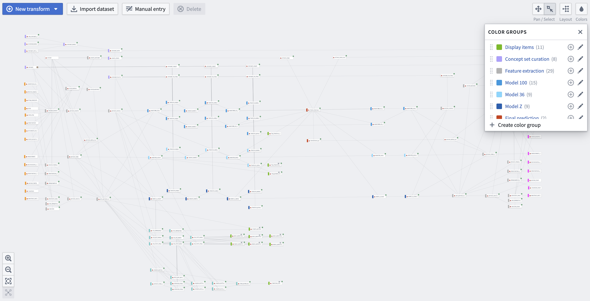

# Documentation

## Global Code

In our submission workbook, we used global Python code ([src/global_code.py](src/global_code.py)) extensively. This was to simplify the transform codes and make the reusable blocks more readable. Most of the function names are self-explanatory. We also organize the utility functions into different sections: data frame manipulation, concept set curation, feature engineering and selection, machine learning, and visualization.

## Transforms 



A data transform in the N3C environment is a basic step in the workflow that takes an input data frame and generates a transformed data frame. In our submission, we have ~100 transforms ([src/](src/)) organized by function in the following groups. 

**Concept Set Curation**
 - *Color*: Purple
 - *Transform name(s)*: raw_concept_bundles, curated_bundles, concept_bundles, concept_sets, event_stats, concept_to_feature
 - *Description*: We collect selected concept sets, concept set bundles (categories), and build extra custom concept sets. We also compute mutual information between the counts of these features with the prediction target for initial screening. Conditional mutual information scores are also computed based on significant events such as pneumonia and emergency room visits.
 - *Input Data:* concept_set_members, concept, Long COVID Silver Standard
 - *Output Data*: A mapping between concept IDs to the curated features (ID, name, source) the associated information (PASC counts, mutual information, etc). This output is used by many transforms. So it is copied multiple times to declutter the workbook diagram. 

**Feature Extraction**
 - *Color*: Grey
 - *Transform name(s)*: merged_events, covid_dates, covid_episodes, person_events, mvisit_features, observation_period_features, demographics, distinct_vax_person, vax_deduplicated, vaccine, person_vaccine, person_labs, person_concept_features, per_person_info
 - *Description*: (1) COVID episodes. We try to identify previous COVID infections based on diagnosis concepts that may have been missed by covid_index which is solely based on measurements. We use 92 days as the threshold between consecutive diagnosis events to delineate different episodes of infection. Based on this criterion, we find the maximum number of infections in the same patient to be 6 in the censored data. These COVID espisode statistics are summarized as part of the global feature set. (2) Merged features. Events in `condition_occurrence`, `device_exposure`, `drug_exposure`, `note`, `note_nlp`, `observation`, `procedure_occurrence`, `visit_occurrence` are merged into one table, person_concept_features, with their domain information preserved. Measurements with values are selected into `person_labs`. Time-invariant features like demographics, vaccine, location and the above mentioned COVID times are merged into `per_person_info`.
 - *Input Data:* condition_occurrence, device_exposure, drug_exposure, note, note_nlp, observation, procedure_occurrence, visit_occurrence, measurement, microvisits_to_macrovisits, observation_period, person_table, location, manifest_safe_harbor
 - *Output Data*: person_concept_features includes all events with timestamps excluding labs; person_labs includes all events in labs with values; per_person_info includes all other static features for each patient.

**Feature Engineering - Model 100, Model 36, and Model Z** 
 - *Color*: Shades of blue (Model 100: Medium Blue; Model 36: Light Blue; Model Z: Deep Blue)
 - *Transform name(s)* (using Model Z as an example): model_z_start, feature_expansion_model_z, subset_model_z, feature_subset_model_z, model_z_data, feature_model_z 
 - *Description*: The starting sets of features (100 for Model 100; 36 for both Model 36 and Model Z) are the result of initial screening based on iterative machine learning trials and manual inspection. Here we process these features with temporal feature engineering techniques, which include computing feature counts in different disease phases and assigning time-based weights. The derived features based on time splits then undergo two rounds of automatic feature selection based on the importance scores from 5-fold cross validation. For example, the number of features for Model Z is first downselected to 96 and finally to 80. This final set of features are used to train Model_Z and passed on to the testing portion of code. Cross validations and feature groupings are also done to provide display items.
 - *Input Data:* per_person_info, person_concept_features, person_labs
 - *Output Data*: A patient-level table with processed features for Model Z, which is ready for training.

**Machine Learning - Training and Inference**
 - *Color*: Red
 - *Transform name(s)*: train_test_model, Convalesco_predictions
 - *Description*: We aggregate all data engineered with different methods, and then perform the machine learning algorithms, as well as providing time bracket prediction and feature completeness estimation.
 - *Input Data:* model100_v1_data, model100_v2_data, model36_data, model_z_data,  Long COVID Silver Standard, model100_v1_test, model100_v2_test, model36_test, model_z_test,  Long COVID Silver Standard Blinded
 - *Output Data*: A patient-level table with prediction results for testing data with 8 columns: 
 ```python
 # Key columns: 
 #   person_id             
 #   outcome_likelihoods:  final prediction on patient PASC probability  
 #   confidence_estimate:  a proxy estimate based on patient data completeness 
 #   likelihood_3month:    predicted probability of PASC within 3 months after COVID index 
 #   likelihood_6month:    predicted probability of PASC within 6 months after COVID index 
 # Additional columns: 
 #   model100_pred:        prediction of Model_100 with 100 temporal features 
 #   model36_pred:         prediction of Model_36, a simple model with 36 temporal features 
 #   model_z_pred:         prediction of Model_Z, an aspiring "zero-bias" model 
 ```

**Visualization**
For demonstration, all our visualization transforms are currently connected to training data, often on validation samples. When real testing data are in place, they can be connected to the testing transforms and are expected to work similarly. 

**Visualization - Feature category Ablation**
 - *Color*:  Light Green
 - *Transform name(s)*: feature_category_ablation_results, fig_feature_category_ablation
 - *Description*: We study the impact of features in several categories and the bar plot visualizes the results.
 - *Input Data:* model36_start, concept_to_feature, concept
 - *Output Data*: A group of bar plots showing accuracy and AUC scores from ablation studies.

**Visualization - Global Features Beeswarm Plot**
 - *Color*:  Light Green
 - *Transform name(s)*: fig_global_features_beeswarm_plot
 - *Description*: We visualize the impact of features by showing the SHAP values of all samples with a beeswarm plot.
 - *Input Data:* model36_start, person_concept_features
 - *Output Data*: A beeswarm plot showing the global importance of several non-temporal features.

**Visualization - Per-Person Force Plot**
 - *Color*: Light green
 - *Transform name(s)*: vis_demographics_features, vis_demographics_model, single_person_force_plot
 - *Description*: We build a model with only basic demographics data as features, and visualize the feature importances for a randomly selected patient with SHAP values and force plots. 
 - *Input Data:* model_z_start
 - *Output Data*: A force plot explaining the contributions of each demographic dimension.

**Visualization - Patient-level Feature Waterfall Plots**
 - *Color*: Light green
 - *Transform name(s)*: vis_full_features, vis_full_model_xgb, vis_full_feature_mapping, pasc_waterfall_demographics, pasc_waterfall_occurrences, pasc_waterfall_measurements, npasc_waterfall_demographics, npasc_waterfall_occurrences, npasc_waterfall_measurements, 
 - *Description*: We explain patient-level feature importance using a variation of Model_Z with full features. Two randomly chosen patients are used for demonstration, and they can be configured in the global Python code with `zz_vis_selected_person` and `zz_vis_nonpasc_person`. We calculate the SHAP value for each feature, and visualize them with waterfall plots. 
 - *Input Data:* model_z_start
 - *Output Data*: Waterfall plots explaining the contributions of individual features in each category.

**Visualization - Timeline Plot**
 - *Color*: Light green
 - *Transform name(s)*: vis_m7_features, vis_m7_model, vis_full_features, vis_full_model, single_person_event_order, select_time_series, mini_per_person_info, ordered_single_person_concept_features_diffv1, ordered_single_measurement_diffv1, single_diffv1_features, single_accu_features, single_diffv1_preds, single_accu_preds, time_preds_multicells, timeline_vis
 - *Description*: To understand how PASC risks evolve over time, we compute the cumulative risk and conduct virtual event knockout experiments, and visualize the timeline of a randomly selected patient in `timeline_vis`. 
 - *Input Data:* person_concept_features, person_labs, per_person_info, model_z_start
 - *Output Data*: A timeline plot showing the impact of individual events on the predicted PASC risk, and day-by-day cumulative risks using only event information prior to the day.

## Execution Engine

The execution engine is a python module (`utils/execution_engine.py`) that executes python code exported from a [Palantir Code Workbook](https://www.palantir.com/docs/foundry/code-workbook/overview/) with minimal modifications.

### Code Layout
All cells in a Code Workbook are datasets. Datasets are either imported from files, or derived from other datasets in the workbook. In the latter case, the cell must include a function that takes the input datasets as arguments and returns the output dataset. They are called **transforms**, and are placed in the `src` directory with their own names. There is also a global code section that is executed before any transform. It is placed in `src/global_code.py`.

### Execution Algorithm
The execution engine reads the function signature of all transform scripts, and builds a dependency graph. It then executes the transforms in topological order. The execution engine also saves the output of each transform in `output` folder. This allows the engine to skip the execution of a transform if it is done before. 

### API Docs
Please refer to docstrings in `utils/execution_engine.py` for more details.

## Tips
 - You can set `PYSPARK_PYTHON` and `PYSPARK_DRIVER_PYTHON` environment variables to the path of your python executable, when an error message says the driver and executor are using different python versions.
 - You can change the executor and driver memory to a value that fits your machine, the more the better.
 - When running a transform with a large number of dependencies, you may get a lot of `WARN RowBasedKeyValueBatch: Calling spill() on RowBasedKeyValueBatch. Will not spill but return 0.` and the execution slows down. This is a similar issue to OOM. You can simply Ctrl-C to stop the execution, and restart it. The engine will skip the transforms that are already done, and will be much faster with a clean state. (Similar issue can be reproduced in the enclave, where the spark module must die at least once in the middle of execution.)

## Modifications
 The original exported code has been modified to make it work with the synthesis dataset, to address the missing datasets and columns. The usage of platform-specific packages are also removed since they are not available publicly. The dataset type of the transform arguments are provided in the form of type annotations. No annotation means the dataset is a pyspark dataframe.
