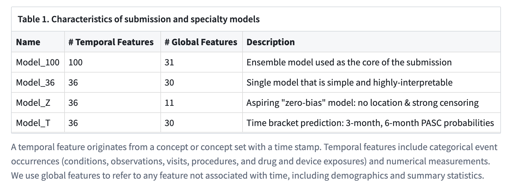
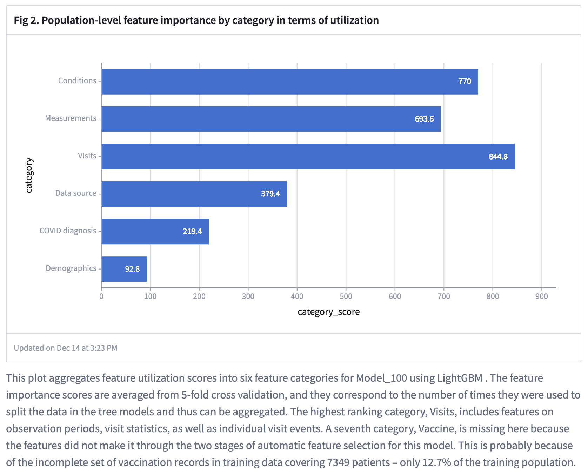

# NIH Long Covid Challenge Solution

This repository contains a winning submission for the NIH Long Covid Computational Challenge ([L3C](https://www.challenge.gov/?challenge=l3c)) developed by [Team Convalesco](https://www.linkedin.com/pulse/announcing-nih-long-covid-computational/). The objective of the challenge was to develop machine learning models to predict which patients are susceptible to developing PASC/Long COVID using structured medical records up to 28 days from COVID onset. 

## Overview

Our solution leverages the rich clinical data available in the [N3C environment](https://ncats.nih.gov/n3c/about/data-overview) including condition occurrences, lab measurements, drug exposure, doctor notes, etc. With model generalizability and robustness in mind, we focus on creating a small number of meaningful features by curating and expanding concept sets. A key idea in feature engineering is to use the temporal information in the medical records to create features that are more predictive of Long COVID risks. The original submission consists of ~100 workflow cells operating on Spark dataframes in the N3C enclave. All the transform codes are included in this repository to be tested and run locally on synthetic data. 

## Installation

1. Clone the repository:
```
git clone https://github.com/levinas/long-covid-prediction.git
cd long-covid-prediction
```

2. Create a virtual environment (optional):
```
conda create -n l3c python=3.10
conda activate l3c
```

3. Install the required packages:
```
pip install -r requirements.txt
```

4. Ensure Java, a [PySpark dependency](https://spark.apache.org/docs/latest/api/python/getting_started/install.html), is installed and the `JAVA_HOME` environment variable is set. 

For example, on an Ubuntu Linux machine, you can run the following command (or use other package managers such as homebrew to avoid sudo):
```
sudo apt-get install openjdk-17-jdk
export JAVA_HOME=/usr/lib/jvm/java-17-openjdk-amd64
```

## Running the Code on Synthetic Data

1. Download the synthetic data: 

Download [synthetic_data.zip](https://www.dropbox.com/s/krrw6ydutf6j98p/synthetic_data.zip?dl=0) (1.5GB). Extract the zip file and place the folder in the root directory of the repo. Make sure the directory structure looks like `synthetic_data/training/person.csv`. A command line example to do this is:
```
cd long-covid-prediction
wget https://www.dropbox.com/s/krrw6ydutf6j98p/synthetic_data.zip
unzip synthetic_data.zip
```

2. Run the demo script from the root directory of the repo:
```
./run_all.sh
```
This will run the entire workflow on the synthetic data. The final output will be saved as `Convalesco_predictions.csv` in the root directory of this repo; all the intermediate output datasets will be saved in the `output/` folder.

The test run on the synthetic data could take 1-2 hours on a typical linux machine with 64 GB memory. PySpark may generate `RowBasedKeyValueBatch` warnings that could be safely ignored.

Th final output is a patient-level table with prediction results for the testing data with 8 columns: 
 ```python
 # Key columns: 
 #   person_id             
 #   outcome_likelihoods:  final prediction on patient PASC probability  
 #   confidence_estimate:  a proxy estimate based on patient data completeness 
 #   likelihood_3month:    predicted probability of PASC within 3 months after COVID index 
 #   likelihood_6month:    predicted probability of PASC within 6 months after COVID index 
 # Additional columns: 
 #   model100_pred:        prediction of Model_100 with 100 temporal features 
 #   model36_pred:         prediction of Model_36, a simple model with 36 temporal features 
 #   model_z_pred:         prediction of Model_Z, an aspiring "zero-bias" model 
 ```
In this example, since we are using synthetic data, the predictions will not be as meaningful.

## Models and Features

We have created 4 models with different emphases, and our submission is an ensemble of the first three. Our submission uses no more than 100 temporal features (including conditions, events, and labs), and we demonstrate that a simple model with a subset of only 36 features incurs a small accuracy loss of 0.1–0.2% compared to our final submission. 



The model features are grouped into seven categories, and the population-level feature utilization scores on the real data are shown in the figure below. 




## Documentation

The key components of the repository are as follows:

- `src/`: Contains all the source code including the ~100 transforms and global code.
- `src/global_code.py`: Global python code.
- `utils/execution_engine.py`: Execution engine.

The original submission was developed on the N3C environment in the form of a [Palantir Code Workbook](https://www.palantir.com/docs/foundry/code-workbook/overview/). We used global Python code extensively to simplify the transform codes and make the reusable blocks more readable. The execution engine is a Python module we developed after the challenge to enable local execution of the original codes with minimal modifications.

For more details, please refer to the [DOCUMENTATION](DOCUMENTATION.md).


